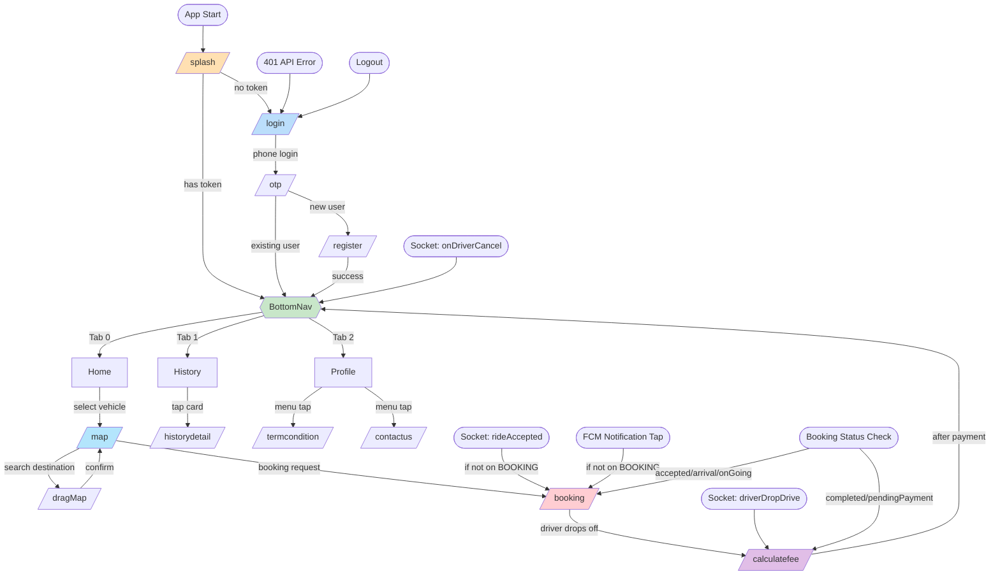

# Phase 2 — Application Flow

## 1. Application Initialization

### Startup Sequence

```
main()                                        [lib/main.dart:27]
  │
  ├─ 1. BaseHttpClient.init()                 [lib/core/api_service/client/dio_http_client.dart]
  │     └─ Creates Dio singleton with baseUrl, 1min timeouts, PrettyDioLogger interceptor
  │
  ├─ 2. WidgetsFlutterBinding.ensureInitialized()
  │
  ├─ 3. NotificationLogic().setupInteractedMessage()   [lib/service/notification_logic.dart]
  │     ├─ Firebase.initializeApp()  (via FlutterFire)
  │     ├─ registerNotification()    (Android channel "booking_channel" + local notifications)
  │     ├─ initializeNotification()  (foreground/background/terminated FCM handlers)
  │     └─ Handles initial message (if app opened from notification tap)
  │
  ├─ 4. FirebaseCrashlytics setup            [lib/main.dart:33-39]
  │     ├─ Disabled in debug mode (kDebugMode)
  │     ├─ FlutterError.onError → Crashlytics
  │     └─ PlatformDispatcher.onError → Crashlytics
  │
  ├─ 5. TaxiNotification.shared.initLocationNotification()  [lib/taxi_single_ton/taxi_notification.dart]
  │     └─ Initializes local notification plugin for booking sounds
  │
  ├─ 6. initialService()                     [lib/app/service.dart]
  │     ├─ Get.put(AppLogic(), permanent: true)           — language, socket, version
  │     ├─ Get.put(BookingSession(), permanent: true)     — booking state machine
  │     └─ Get.put(NotificationLogic(), permanent: true)  — Firebase messaging
  │
  ├─ 7. configLoading()                      [lib/main.dart:41-60]
  │     └─ Configures EasyLoading overlay (fadingCircle, custom animation)
  │
  └─ 8. runApp(ToastificationWrapper(Root()))  [lib/main.dart:62]
        └─ Root → GetMaterialApp with initialRoute: /splash
```

### First Screen Decision

File: `lib/presentation/screens/splash_screen/logic.dart`

```
SplashLogic.onInit()
  │
  ├─ Wait 1 second
  │
  └─ SessionService.instance.getToken()
       │
       ├─ token == null ──→ Get.offAllNamed(AppRoutes.LOGIN)
       │
       └─ token exists ───→ Get.offAllNamed(AppRoutes.BOTTOMNAV)
```

The splash screen is a branding screen (logo + "TAARRAA Taxi" text) shown for 1 second while the token check runs.

---

## 2. Navigation Inventory

### Confirmed Active Screens

| # | Screen | Route | File | Parameters | Entry Actions |
|---|--------|-------|------|------------|---------------|
| 1 | Splash | `/splash` | `splash_screen/view.dart` | — | Token check → redirect |
| 2 | Login | `/login` | `login/view.dart` | — | Phone input form |
| 3 | OTP Verification | `/otp` | `otp/view.dart` | `phoneNumber`, `resendTime` | 4-digit OTP input |
| 4 | Register | `/register` | `register/view.dart` | — | Name + profile image |
| 5 | Bottom Nav | `/bottomnav` | `bottom_nav/view.dart` | — | 3-tab host (Home, History, Profile) |
| 6 | Home | Tab 0 of BottomNav | `home/view.dart` | — | Vehicle grid, booking status check |
| 7 | Map | `/map` | `map_screen/view.dart` | `vehicleId` | Google Map + booking request |
| 8 | Map Drag (Search) | `/dragMap` | `shared/map_drag/view.dart` | `MapDragPurpose` (pickup/destination) | Search + pin location |
| 9 | Booking Map | `/booking` | `booking_map_screen/booking_map_screen.dart` | — | Active ride tracking |
| 10 | Calculate Fee | `/calculatefee` | `calculate_fee/calculate_fee_screen.dart` | — | Fare display + payment wait |
| 11 | History | Tab 1 of BottomNav | `history/view.dart` | — | Completed/Cancelled tabs |
| 12 | History Detail | `/historydetail` | `history_detail/view.dart` | `Datum` (history item) | Route map + details |
| 13 | Profile | Tab 2 of BottomNav | `profile/profile_screen.dart` | — | Profile info + settings |
| 14 | Terms & Conditions | `/termcondition` | `term_condition/view.dart` | — | Static terms list |
| 15 | Contact Us | `/contactus` | `contact_us/view.dart` | — | Contact info |
| 16 | Announcement | `/announcement` | `announcement/view.dart` | — | Paginated announcement list |
| 17 | Announcement Detail | `/announcement_detail` | `announcement_detail/view.dart` | `id` | Announcement content + images |

### Navigation Graph (Mermaid)



### Possibly Active / Deprecated Routes

| Route | Status | Notes |
|---|---|---|
| `/home` | Possibly Active | Defined in `AppPages` but `HomeScreen` is always accessed as a tab in `BottomNav`, not via direct route navigation |
| `/map` (standalone) | Active | Used by `HomeScreen` → `Get.toNamed(AppRoutes.MAP, arguments: {vehicleId})` |
| `ANNOUNCEMENT` / `ANNOUNCEMENTDETAIL` | POSSIBLY ACTIVE | Announcement bell button on `HomeScreen` is commented out in view.dart — routes exist but entry point is disabled |

---

## 3. Major User Flows

### Flow 1: Authentication (Login → OTP → Register)

```
Entry: SPLASH → no token
  │
  ├─ [LOGIN]
  │   ├─ User toggles language (EN/KM)
  │   ├─ User enters phone number (digits only, max 12)
  │   ├─ User taps "Next"
  │   │   ├─ Phone validation: PhoneRepo.isValid()
  │   │   ├─ Invalid → haptic feedback + shake animation + snackbar
  │   │   └─ Valid → POST /taxi-passenger/login-phone → returns OTP resend seconds
  │   │
  │   ├─ [OTP]
  │   │   ├─ 4-digit PIN input (Pinput widget)
  │   │   ├─ Auto-reads SMS via SmartAuth
  │   │   ├─ 30-second countdown timer (SlideCountdown)
  │   │   ├─ Auto-verifies on 4 digits entered
  │   │   │   ├─ POST /taxi-passenger/verify-phone-otp
  │   │   │   ├─ Response has user + token → save token → BOTTOMNAV
  │   │   │   ├─ Response has no user → REGISTER
  │   │   │   └─ Error → shake + error dialog (retry)
  │   │   ├─ "Send Again" when timer reaches 0 → resend login
  │   │   └─ Back → Get.back()
  │   │
  │   └─ [REGISTER]
  │       ├─ Optional: toggle language
  │       ├─ Optional: upload profile photo (camera or gallery via ImagePicker)
  │       ├─ Enter full name
  │       ├─ Tap "Create" → POST /taxi-passenger/register (multipart)
  │       │   └─ Success → save token → BOTTOMNAV
  │       └─ Tap "Skip" → auto-generate name from timestamp → register → BOTTOMNAV
  │
  └─ [BOTTOMNAV] ← clear stack
```

**API Interactions:**
- `POST /taxi-passenger/login-phone` — sends phone, returns OTP countdown seconds
- `POST /taxi-passenger/verify-phone-otp` — verifies OTP, returns user + token (or empty for new users)
- `POST /taxi-passenger/register` — multipart form with name, phone, profile image

**Services:** `AuthDatasource` → `AuthRepository` → `LoginLogic` / `OtpLogic` / `RegisterLogic`

### Flow 2: Vehicle Selection → Booking Request

```
Entry: BOTTOMNAV → Tab 0 (Home)
  │
  ├─ [HOME]
  │   ├─ onInit: initSocket(), getVehicleType(), getAppUpdate(), pushFcmToken()
  │   ├─ onReady: requestLocationPermission(), checkBookingStatus()
  │   ├─ Displays 2x2 grid + center VIP circle (5 vehicle cards)
  │   ├─ Pull to refresh → refetch vehicle types
  │   ├─ Tap vehicle card → Get.toNamed(MAP, arguments: {vehicleId})
  │   └─ [Booking redirect check]
  │       └─ If active booking exists → redirect to BOOKING or CALCULATEFEE
  │
  ├─ [MAP]
  │   ├─ onInit: receives vehicleId from arguments
  │   ├─ Full-screen Google Map with current location
  │   ├─ Center pin marker (pickup indicator)
  │   ├─ "Where to go" search bar → navigates to DRAGMAP
  │   │
  │   ├─ [DRAGMAP — Destination Search]
  │   │   ├─ Text input → debounced Places API search (300ms, min 3 chars)
  │   │   ├─ Search results → tap prediction → place details → LatLng
  │   │   ├─ "Set location on map" → full map with draggable pin
  │   │   ├─ Confirm → returns LatLng to MAP
  │   │   └─ Pickup flow: shows address label + driver note field (max 60 chars)
  │   │
  │   ├─ [Back to MAP with destination]
  │   │   ├─ Draws polyline (pickup → destination)
  │   │   ├─ Calculates distance via Google Directions API
  │   │   ├─ Estimates fare based on vehicle price + distance
  │   │   ├─ Shows: pickup address, destination address, distance, fare
  │   │   ├─ "Tarif" button → DetailServiceDialog (min fee, price/km)
  │   │   └─ "Booking Now" → requestBooking()
  │   │
  │   └─ [Booking Request]
  │       ├─ POST /taxi-passenger/request-booking
  │       ├─ Emits rideRequest via Socket.IO
  │       ├─ Shows loading overlay with cancel button
  │       ├─ On success → navigates to BOOKING
  │       └─ On cancel → dismisses overlay
  │
  └─ [BOOKING]
      ├─ Cannot go back (PopScope: canPop = false)
      ├─ Real-time map with driver + passenger markers
      ├─ 10s polling (60s if socket connected) for booking status
      ├─ Socket events: rideAccepted → driverArrival → driverStartDrive
      ├─ Status text updates via AppLogic.titleEvent
      ├─ Cancel button (hidden when driver arrived)
      └─ Driver drop-off → navigates to CALCULATEFEE
```

**API Interactions:**
- `GET /taxi/get-type-vehicle` — fetch vehicle types
- `POST /taxi-passenger/get-driver-location-around` — nearby drivers
- `POST /taxi-passenger/request-booking` — create booking
- `POST /taxi-passenger/cancel-request-booking-info` — cancel booking
- `POST /taxi-passenger/update-passenger-location` — update GPS
- `GET /taxi-passenger/get-request-booking-info` — poll booking status
- Google Directions API — distance/duration/polyline
- Google Places API — search + details

### Flow 3: Payment and Ride Completion

```
Entry: BOOKING → driver drops off (Socket: driverDropDrive)
  │
  └─ [CALCULATE_FEE]
      ├─ Fetches booking info via CheckBookingApi
      ├─ Displays read-only:
      │   ├─ Driver info (name, photo, vehicle)
      │   ├─ Distance, duration, date/time
      │   ├─ Pickup → destination route
      │   ├─ Total price
      │   └─ "Wait payment from driver" message
      ├─ Socket: driverAcceptPayment → confirms payment
      └─ syncNavigateBack() → BOTTOMNAV (reinitializes socket)
```

### Flow 4: Booking History

```
Entry: BOTTOMNAV → Tab 1 (History)
  │
  ├─ [HISTORY]
  │   ├─ TabBar: Completed (status=4) | Cancelled (status=5)
  │   ├─ PagedListView with infinite scroll pagination
  │   ├─ Pull to refresh
  │   ├─ Each card shows: passenger image, invoice, driver name, status badge,
  │   │   distance, duration, amount, vehicle type, addresses, map placeholder
  │   └─ Tap card → Get.toNamed(HISTORYDETAIL, arguments: data)
  │
  └─ [HISTORY_DETAIL]
      ├─ Receives Datum object via Get.arguments
      ├─ Same card layout as history card (read-only)
      ├─ Google Map with:
      │   ├─ Route polyline (pickup → destination)
      │   ├─ Driver marker at start
      │   └─ Passenger marker at end
      └─ Back via AppBar
```

### Flow 5: Profile and Settings

```
Entry: BOTTOMNAV → Tab 2 (Profile)
  │
  ├─ [PROFILE]
  │   ├─ Profile image + name + "See Your Profile" text
  │   ├─ Language toggle (EN/KM)
  │   ├─ "Terms & Conditions" → TERMCONDITION
  │   ├─ "Contact Us" → CONTACTUS
  │   └─ Logout (currently commented out in view; exists in AppLogic)
  │
  ├─ [TERMCONDITION]
  │   └─ 5 hardcoded terms in ListView
  │
  └─ [CONTACTUS]
      ├─ Company logo
      ├─ 2 phone numbers (tappable → phone dialer)
      ├─ Email (tappable → mailto)
      ├─ Address (non-tappable)
      └─ Copyright text
```

---

## 4. Authentication and Session Behavior

### Login Flow
- Phone-based OTP authentication (no password)
- OTP sent via `POST /taxi-passenger/login-phone`
- Verified via `POST /taxi-passenger/verify-phone-otp`
- Token returned in response body → saved to `FlutterSecureStorage`

### Token Storage
- **Primary:** `FlutterSecureStorage` (key: `session_token`)
- **Legacy:** `SharedPreferences` JSON blob (migration bridge)
- **In-memory:** Cached in `SessionService._cachedToken` for fast access

### Logout
- `AppLogic.logout()` → confirmation dialog → `SessionService.clear()` → `Get.offAllNamed(AppRoutes.LOGIN)`

### Expired Session (401)
- Both API clients detect 401 in response
- `SessionService.handleUnauthorized()` → clears token → `Get.offAllNamed(AppRoutes.LOGIN)`
- 403 does NOT trigger logout (permission error, not session expiry)

### Route Guards
- No formal middleware or guards
- Auth gate: `SplashLogic._checkAuthorization()` on app start
- No re-authentication checks during the session (only on 401)

---

## 5. External Triggers

### Push Notifications (FCM)

File: `lib/service/notification_logic.dart`

- **Setup:** `NotificationLogic.setupInteractedMessage()` in `main()`
- **Android channel:** `booking_channel` (high importance, custom booking sound)
- **Handlers:** Foreground (snackbar), background (local notification), terminated (notification tap)
- **Notification tap:** `handleOnNotificationPress()` → if not on BOOKING route → `Get.offNamed(AppRoutes.BOOKING)`

### Socket.IO Events

File: `lib/services/socket_service.dart`

| Event | Direction | Effect |
|---|---|---|
| `rideAccepted` | Server → Client | Navigate to BOOKING (if not there), update driver info |
| `driverArrival` | Server → Client | Refresh booking state on BOOKING screen |
| `driverStartDrive` | Server → Client | Refresh booking state, update status |
| `driverDropDrive` | Server → Client | Navigate to CALCULATEFEE |
| `driverAcceptPayment` | Server → Client | Sync CalculateFeeLogic, confirm payment |
| `onDriverCancel` | Server → Client | Show info dialog, navigate to BOTTOMNAV |
| `rideRequest` | Client → Server | Emit booking request data |
| `rideRequestSpecificDriver` | Client → Server | Emit booking request to specific driver |
| `passengerCancelDrive` | Client → Server | Emit cancellation |

### Location Updates

File: `lib/services/location_service.dart`

- `LocationService` (singleton) manages a GPS position stream
- Used by `GoogleMapLogic` for real-time passenger tracking on the map
- Does NOT post continuous location to server (passenger has no location reporting)

### App Update Check

File: `lib/app/logic.dart`

- `AppLogic.getAppUpdate()` → `GET /taxi/get-current-app-version/2`
- Compares installed version with latest
- Shows update dialog with version info, features list, and store links
- "Update Now" → `url_launcher` opens App Store / Play Store
- "Later" → dismisses dialog
