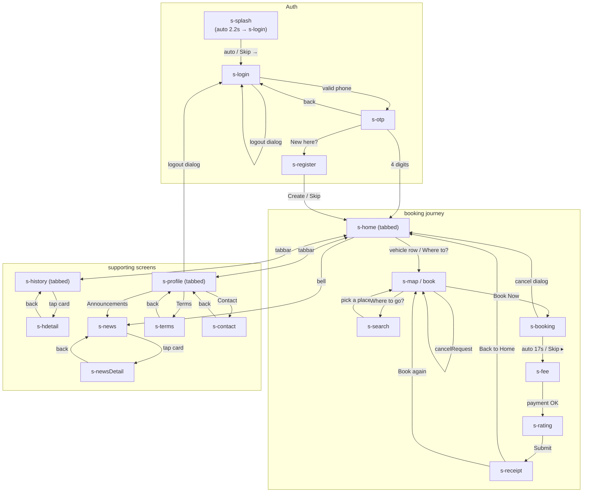

# 02 — Screen Map & Navigation

> All IDs, entry/exit paths, and relationships below are taken directly from the HTML/JS
> (`NAMES`, `JUMPS`, `TABS`, `show()`, `goMap()`, inline `onclick`, and render functions).

## 1. Classification legend

- **SCREEN** — full-page destination (a `<section class="screen">`)
- **TABBED** — a SCREEN that also shows the floating pill `.tabbar` (Home / My Booking / Profile)
- **OVERLAY** — full-screen layer over a screen (the booking overlay `#bookOv` over the map)
- **BOTTOM SHEET** — `.sheet` inside `#sheetRoot`, or `.bsheet` (map/booking persistent sheets)
- **DIALOG** — `.dialog` inside `#dialogRoot`
- **TOAST** — transient notification (`#toast`)
- **COMPONENT** — reusable piece (documented in 03, not a destination)

## 2. Screen inventory

| ID | Screen / State | Type | Source | Entry | Exit | Key components |
| --- | --- | --- | --- | --- | --- | --- |
| `s-splash` | Splash / boot | SCREEN | static | initial `show('s-splash')` | auto-advance after 2.2s → `s-login`; manual "Skip →" → `s-login` | `.splash-logo`, `.logo-badge`, `.splash-name`, `.splash-sub`, `.splash-load` |
| `s-login` | Login (phone entry) | SCREEN | static | from splash (auto/skip); from logout dialog | valid phone → `s-otp` | `.steps` (1/3), `.seg` (lang), `.field` phone `+855`, `#phoneErr`, CTA |
| `s-otp` | OTP verification | SCREEN | static | from login (valid phone) | all 4 digits → `s-home`; back → `s-login`; "New here?" → `s-register` | `.steps` (2/3), 4× `.otp` inputs, `#otpTimer` (0:30), `#resendBtn` |
| `s-register` | Complete profile | SCREEN | static | from OTP ("New here? … →") | "Create" (name ≥ 2) or "Skip" → `s-home` | `.steps` (3/3), `.seg`, `.avatar-pick` + `.cam`, `#regName`, `#regBtn` (Create) + `.btn.ghost` (Skip) |
| `s-home` | Home (choose ride) | SCREEN · TABBED | static | post-OTP / post-register / receipt "Back to Home" / booking cancel | vehicle row or "Where to?" → `s-map` | `.home-head`, `.brand`, `.promo`, `.where`, `.sec-row`, `#vehList` (skeleton `.skel` → `.veh`) |
| `s-map` | Map / Book | SCREEN | static (`nomap-pad`) | home (any vehicle row, or `goMap`) | back → `s-home`; "Where to go?" → `s-search`; Book Now → `#bookOv` → `s-booking` | `#mapMain`, `.map-top` (back + "My Location" pill), `.center-pin`, `.fab` (locate), `#mapSheet` (`.bsheet`), `#bookOv` |
| `s-search` | Search (set destination) | SCREEN | static | "Where to go?" from map | back → `s-map`; pick a place → `s-map` (sets `S.dest`) | `.appbar`, `.minimap` + `.center-pin`, `.field` (search), `#searchList` (`.place` rows), "near Phnom Penh" note |
| `s-booking` | Active ride | SCREEN | static (`nomap-pad`) | booking overlay completes (`requestBooking`) | auto 17s or "Skip ▸" → `s-fee`; Cancel dialog → `s-home` | `#mapBook` (`.mapwrap`), `.status-pill` + `.pulse`, `.skip`, `.bsheet` (`.timeline`, `#driverCard`, Call/Safety, `#cancelBtn`) |
| `s-fee` | Trip fare | SCREEN | static | from booking (`finishTrip`) | payment confirmed (auto 9s / demo "Simulate") → `s-rating` (~900ms after) | `.appbar`, `#feeBody` (`.card`, `.kv`, `.addr-row`, `.total-box`, `#payBox`) |
| `s-rating` | Rate your driver | SCREEN | static | from fee after payment | "Submit" → `s-receipt` | `.davatar` (72px), `#stars`, `#tagChips`, `#rateNote`, `#rateBtn` (disabled until a star) |
| `s-receipt` | Receipt | SCREEN | static | "Submit" from rating | "Back to Home" → `s-home`; "Book again" → `s-map` | `.check-big`, `#receiptCard` (`.kv` rows), "Back to Home", "Book again" |
| `s-history` | Riding History | SCREEN · TABBED | static | tabbar / `show` | tap a `.hcard` → `s-hdetail` | `.appbar`, `.tabs` (Completed/Cancelled), `#histList` (`.hcard`) |
| `s-hdetail` | History detail | SCREEN | static | tap `.hcard` → `show('s-hdetail')` | back → `s-history` | `.appbar` (back + INV no.), `.minimap` (`#mapHist`), `.card` `#hdetailBody` |
| `s-profile` | Profile | SCREEN · TABBED | static | tabbar / `show` | menu rows → `s-news` / `s-terms` / `s-contact`; logout dialog → `s-login` | `.toprow` (h2 + `.seg`), `.prof-head` (`.davatar` + name/phone), `.prow` rows (bell/pin/doc/mail/out-danger), version |
| `s-news` | Announcements | SCREEN | static | home bell, profile "Announcements" row | back → `s-home`; tap a `.news` card → `s-newsDetail` | `.appbar`, `#newsList` (`.news` cards) |
| `s-newsDetail` | Announcement detail | SCREEN | static | tap `.news` card | back → `s-news` | `.appbar`, `.card` `#newsDetail` (title, `.dt`, body, `.img-ph`) |
| `s-terms` | Terms & Conditions | SCREEN | static | profile row | back → `s-profile` | `.appbar`, `#termsList` (`.term` numbered rows) |
| `s-contact` | Contact Us | SCREEN | static | profile row | back → `s-profile` | `.appbar`, `.logo-badge`, `.prow` rows (Smart/Cellcard phone, email, address) |
| `s-ds` | Design tokens · v2 | SCREEN (reference) | static | prototype jump only | back → `s-home` | swatches (`.swatch`), type rows (`.trow`), component demos, spacing scale |

> **Production note:** `s-ds` is the in-prototype style guide (this is what `docs/ux-redesign/
> 02-design-system.md` distills). It never ships.

## 3. Overlays / sheets / dialogs / toast / tab bar

| ID / anchor | Type | Purpose | Entry | Exit |
| --- | --- | --- | --- | --- |
| `.tabbar` (nav) | TAB BAR (floating pill, 3 tabs) | Home / My Booking / Profile | `show()` on `s-home`/`s-history`/`s-profile` only | any non-TABBED screen |
| `#bookOv` (.bookov) | OVERLAY (full-screen) | "Contacting nearby drivers…" over the map | `requestBooking()` | auto 2.8s → `s-booking`; `cancelRequest()` → map |
| `#sheetRoot` (`.sheet`) | BOTTOM SHEET (generic) | tariff sheet, prototype jump sheet | `openSheet(html)` | `closeSheet()` (backdrop, Escape) |
| `#mapSheet` / booking `.bsheet` | BOTTOM SHEET (persistent) | map booking controls / active-ride controls | `renderMap()` / `renderBookingChrome()` | part of the screen (not separately closable) |
| `#dialogRoot` (`.dialog`) | DIALOG (generic) | cancel booking, logout | `openDialog(html)` | `closeDialog()` / buttons / Escape |
| `#toast` | TOAST | transient feedback | `toast(msg)` (many call sites) | auto-hide 2.4s |

## 4. Screen map table (concise)

| ID | Screen | Type | Source | Entry | Exit | Key components |
| -- | ------ | ---- | ------ | ----- | ---- | -------------- |
| S01 | Splash | SCREEN | static | app start | auto 2.2s / Skip | logo-badge, name, load bar |
| S02 | Login | SCREEN | static | splash, logout, back | Next → OTP | phone field, steps, lang seg |
| S03 | OTP | SCREEN | static | login | 4 digits → Home | otp-row, 0:30 timer, resend |
| S04 | Register | SCREEN | static | OTP link | Create/Skip → Home | avatar-pick, name, Create/Skip |
| S05 | Home | TABBED | static | post-auth | → Map | promo, where card, veh list |
| S06 | Map / Book | SCREEN | static | Home | → Search / Booking | map, center-pin, sheet, bookOv |
| S07 | Search | SCREEN | static | Map | → Map (dest set) | minimap, search field, places |
| S08 | Active ride | SCREEN | static | bookOv | → Fee / Home | status pill, timeline, driver card |
| S09 | Trip fare | SCREEN | static | Booking | → Rating | receipt card, total box, payBox |
| S10 | Rating | SCREEN | static | Fee | → Receipt | stars, tone chips, note |
| S11 | Receipt | SCREEN | static | Rating | → Home / Map | check-big, receipt card |
| S12 | History | TABBED | static | tabbar | → History detail | completed/cancelled tabs, hcards |
| S13 | History detail | SCREEN | static | History | back | minimap, receipt card |
| S14 | Profile | TABBED | static | tabbar | → News/Terms/Contact/Login | prof-head, promo rows |
| S15 | Announcements | SCREEN | static | Home bell / Profile | → News detail | news cards |
| S16 | News detail | SCREEN | static | Announcements | back | body + img placeholder |
| S17 | Terms | SCREEN | static | Profile | back | numbered term rows |
| S18 | Contact | SCREEN | static | Profile | back | logo, contact rows |
| — | Design tokens | (reference) | static | jump only | — | swatches, type, spacing |

## 5. Navigation graph (Mermaid)

### Notes on navigation (evidence-based)

- Three TABBED screens share the floating pill tab bar (`.tabbar`): Home / My Booking (history)
  / Profile. Every other screen has an `.appbar` back button.
- The booking journey is a straight spine: `Home → Map → (Search ⇄ Map) → Booking → Fee → Rating
  → Receipt → Home | Map`. There is no drawer and no shell-with-tabs beyond the 3-screen tabbar.
- `show()` silently defaults `S.dest` to `PLACES[0]` when jumping directly into
  map/booking/fee/rating/receipt — a demo convenience, not app behaviour.
- Booking auto-advances on timers in the prototype (driver-arriving 4s → on-trip 9.5s → fee 17s);
  the real app advances on socket events only (see `roadmap.md` C5).
- History detail always renders `HIST_DONE[0]` — a hardcoded demo row, not a real lookup.

## 6. Related screens (edge list)

- `s-splash` → `s-login`
- `s-login` ⇄ `s-otp` (back); `s-otp` → `s-register`; `s-otp` → `s-home`; `s-register` → `s-home`
- `s-home` ⇄ `s-map` (`goMap`); `s-map` ⇄ `s-search`; `s-search` → `s-map` (pick)
- `s-map` → `s-booking`; `s-booking` ⇄ `s-home` (cancel); `s-booking` → `s-fee`; `s-fee` → `s-rating`
- `s-rating` → `s-receipt`; `s-receipt` → `s-home` / `s-map`
- `s-home` ⇄ `s-history` ⇄ `s-profile` (tabbar); `s-history` → `s-hdetail`
- `s-profile` → `s-news` / `s-terms` / `s-contact`; `s-home` → `s-news` (bell)
- `s-news` → `s-newsDetail`; logout dialog → `s-login`